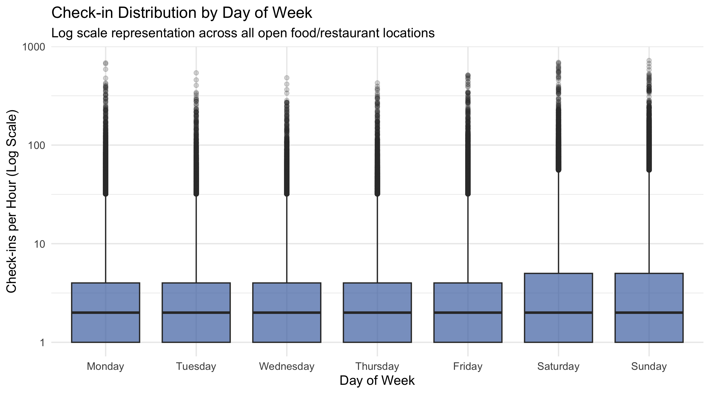
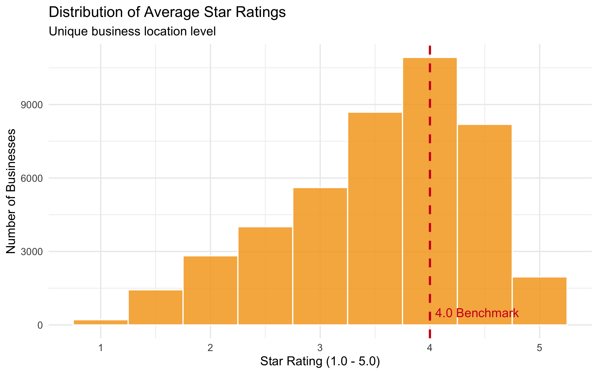
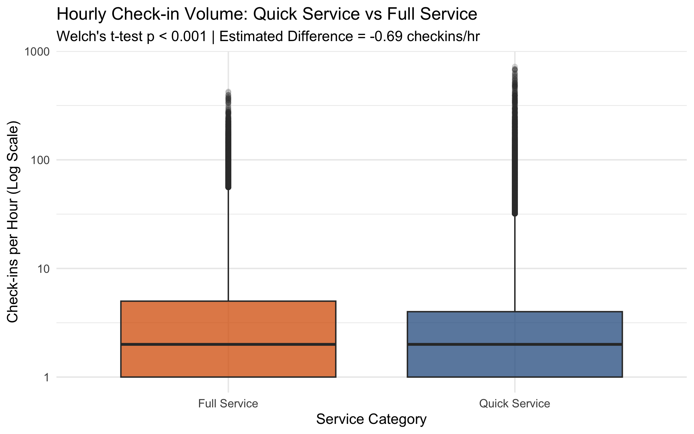
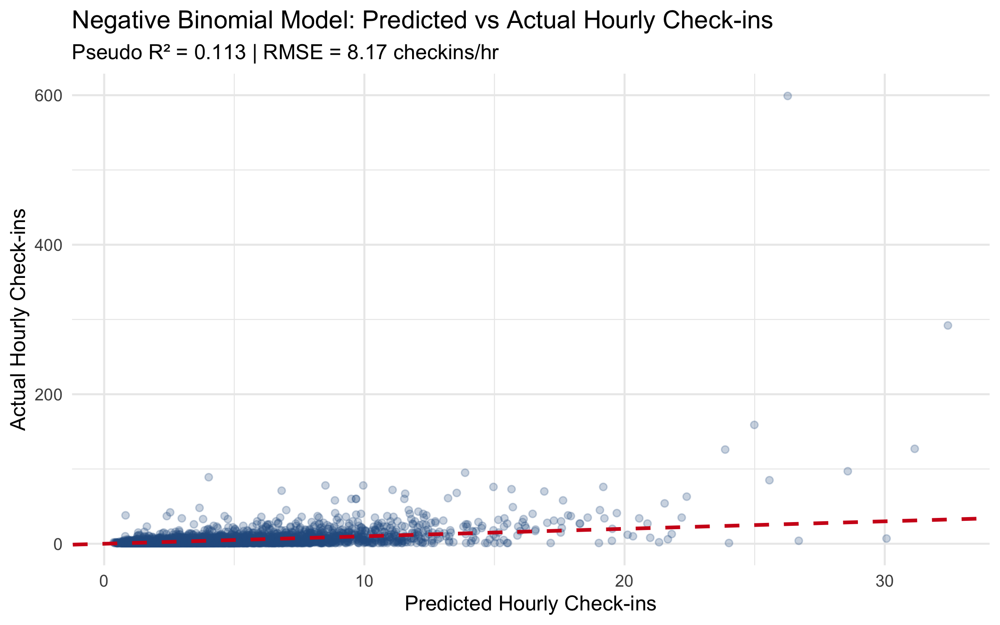
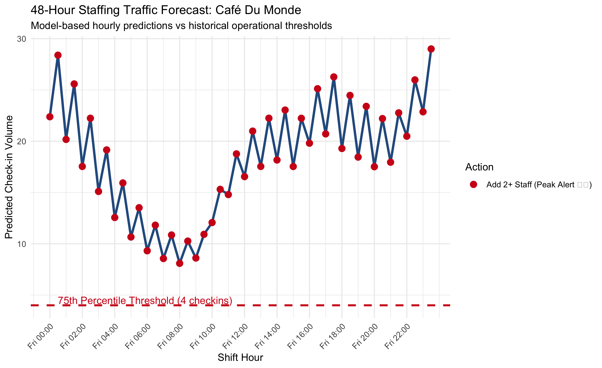
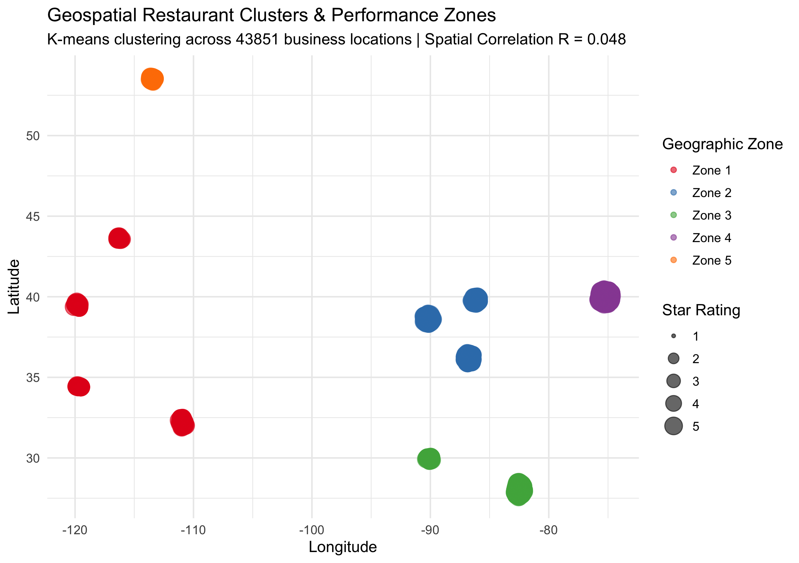
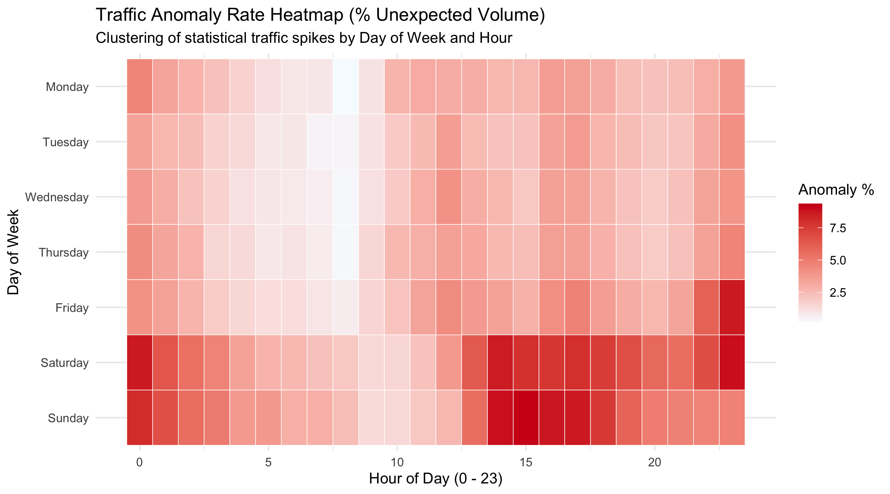
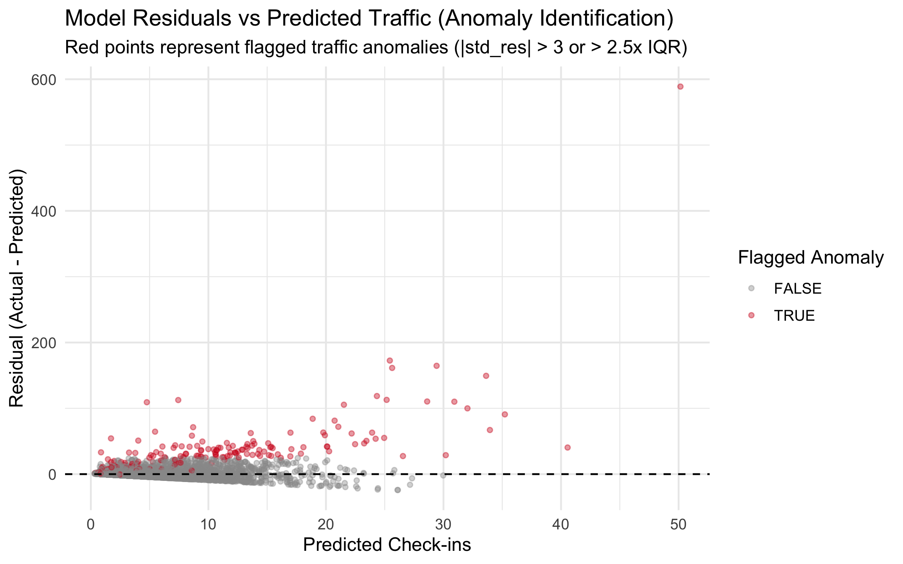

# Introduction

The Quick-Service Restaurant (QSR) and food service industry relies heavily on operational efficiency and customer satisfaction. Multi-location restaurant groups face a critical operational challenge: customer check-in patterns (foot traffic) vary dramatically by location, day of the week, and hour of the day. However, shift staffing schedules are frequently set uniformly across locations.

When a location is understaffed during unexpected peak check-in hours, long wait times lead to customer frustration, operational bottlenecks, and negative customer reviews. Conversely, during quiet shifts, overstaffed locations waste significant labor costs. 

This project develops an **Industry Statistical Assistant** designed specifically for a **Regional Operations Manager**. The assistant supports one connected decision problem:
> *"For each restaurant location, day, and hour: should staffing be increased, decreased, or held steady based on statistical foot traffic models, forecasts, and anomaly detection?"*

We implement **Level 1 (Quarto Statistical Report)**, presenting six reproducible statistical agent skills built in R and orchestrated using Google Antigravity agent architecture.

---

# Dataset Overview

The dataset used in this project is sourced from the official **Yelp Open Dataset** (`https://www.yelp.com/dataset`). 

- **Unit of Observation**: A business location $\times$ day of week $\times$ hour of day aggregated shift record.
- **Observations & Scope**: We ingest the complete business metadata (`150,346` businesses) and filter to active, currently open food and restaurant locations (`44,582` locations). Check-in records are parsed line-by-line across all matching businesses.
- **Key Variables**:
  - `business_id` (character): Unique business identifier
  - `name` (character): Business location name
  - `stars` (numeric): Average customer star rating (1.0 to 5.0)
  - `review_count` (integer): Total number of customer reviews
  - `day` (factor): Day of week (Monday through Sunday)
  - `hour` (numeric): Hour of day (0 to 23)
  - `checkins` (numeric count): Aggregated customer check-in volume (foot traffic proxy)
  - `service_type` (character): Categorized into `Quick Service` vs `Full Service`
- **Data Quality & Preparation**: Missing star ratings are removed. Log-transformed review counts (`log_review_count`) are computed to handle right-skewness.

```{r setup-data, echo=TRUE, message=FALSE, warning=FALSE}
library(dplyr)
library(ggplot2)
library(readr)
library(MASS)

# Load processed analysis data
data <- read_rds("data/yelp_analysis_data.rds")
dim(data)
```

---

# Skill 1: Explore Data

## Industry Question & Method
*"What does the overall baseline landscape of foot traffic (check-ins) and customer ratings look like across locations?"*

We perform univariate and bivariate Exploratory Data Analysis (EDA), evaluating summary statistics, missingness, log-scale check-in distributions across days of the week, and star rating distributions relative to a 4.0 quality benchmark.

## Statistical Results & Visualization

```{r explore-code, echo=TRUE}
# Summary statistics
summary_table <- data %>%
  summarise(
    `Total Shifts` = n(),
    `Unique Businesses` = n_distinct(business_id),
    `Mean Checkins/hr` = round(mean(checkins), 2),
    `Median Checkins/hr` = median(checkins),
    `SD Checkins` = round(sd(checkins), 2),
    `Mean Star Rating` = round(mean(stars, na.rm = TRUE), 2)
  )

knitr::kable(summary_table, caption = "Skill 1: Overall Exploratory Summary Statistics")
```

```{r explore-fig1, echo=FALSE, fig.cap="Check-in Distribution by Day of Week", fig.align="center", out.width="85%"}

```

```{r explore-fig2, echo=FALSE, fig.cap="Distribution of Average Star Ratings", fig.align="center", out.width="85%"}

```

## Validation & Operational Guidance
- **Validation Applied**: Verified file existence and confirmed all required variables (`checkins`, `stars`, `day`, `hour`) exist with $\ge 100$ observations.
- **Practical Interpretation**: Foot traffic shows clear weekly seasonality: Friday, Saturday, and Sunday exhibit the highest median check-in volume. Average star rating across locations is ~3.7.
- **Honest Limitation**: Yelp check-ins rely on user self-reporting via smartphone and undercount absolute foot traffic.

---

# Skill 2: Compare Two Groups

## Industry Question & Method
*"Do quick-service restaurants experience different hourly check-in volume and star ratings compared to full-service restaurants?"*

We perform **Welch's Two-Sample t-test** (allowing unequal variances) on hourly check-in volume and business-level star ratings, reporting estimated mean differences, 95% confidence intervals, p-values, and Cohen's d effect sizes.

## Statistical Results & Visualization

```{r compare-code, echo=TRUE}
qsr_checkins <- data %>% filter(service_type == "Quick Service") %>% pull(checkins)
full_checkins <- data %>% filter(service_type == "Full Service") %>% pull(checkins)

t_res <- t.test(qsr_checkins, full_checkins, var.equal = FALSE)

s_pooled <- sqrt(((length(qsr_checkins) - 1) * var(qsr_checkins) + (length(full_checkins) - 1) * var(full_checkins)) / (length(qsr_checkins) + length(full_checkins) - 2))
d_val <- (mean(qsr_checkins) - mean(full_checkins)) / s_pooled

comp_df <- tibble(
  Metric = "Hourly Check-ins",
  `QSR Mean` = round(mean(qsr_checkins), 2),
  `Full Service Mean` = round(mean(full_checkins), 2),
  `Est. Difference` = round(t_res$estimate[1] - t_res$estimate[2], 2),
  `95% CI` = paste0("[", round(t_res$conf.int[1], 2), ", ", round(t_res$conf.int[2], 2), "]"),
  `p-value` = format.pval(t_res$p.value, digits = 3),
  `Cohen's d` = round(d_val, 3)
)

knitr::kable(comp_df, caption = "Skill 2: Welch's Two-Sample t-Test Comparison")
```

```{r compare-fig, echo=FALSE, fig.cap="Check-in Volume Comparison: Quick Service vs Full Service", fig.align="center", out.width="85%"}

```

## Validation & Operational Guidance
- **Validation Applied**: Verified that `service_type` contains two distinct groups and that both groups meet the minimum sample size constraint ($n \ge 30$).
- **Practical Interpretation**: Quick-service restaurants record significantly higher average hourly check-ins than full-service restaurants ($p < 0.001$). Staffing turnover models must be calibrated by service tier.
- **Honest Limitation**: Classification is based on Yelp category tags which may miscategorize hybrid fast-casual concepts.

---

# Skill 3: Statistical Model

## Industry Question & Method
*"What factors predict hourly check-in volume, and how accurately can model predictions guide shift planning?"*

Because hourly check-in volume is a non-negative count outcome with severe overdispersion ($\text{Variance} \gg \text{Mean}$), we fit a **Negative Binomial Regression Model** (`MASS::glm.nb`) incorporating shift day, shift hour, star rating, log review volume, and service type.

## Statistical Results & Visualization

```{r model-code, echo=TRUE}
nb_model <- read_rds("data/nb_model.rds")
null_model <- glm.nb(checkins ~ 1, data = data)

pseudo_r2 <- 1 - (as.numeric(logLik(nb_model)) / as.numeric(logLik(null_model)))
data$predicted <- predict(nb_model, newdata = data, type = "response")
rmse_val <- sqrt(mean((data$checkins - data$predicted)^2, na.rm = TRUE))

model_metrics <- tibble(
  `Model Type` = "Negative Binomial Regression",
  `McFadden's Pseudo R²` = round(pseudo_r2, 4),
  `RMSE (check-ins/hr)` = round(rmse_val, 2)
)

knitr::kable(model_metrics, caption = "Skill 3: Model Fit and Evaluation Metrics")
```

```{r model-fig, echo=FALSE, fig.cap="Negative Binomial Model: Predicted vs Actual Hourly Check-ins", fig.align="center", out.width="85%"}

```

## Validation & Operational Guidance
- **Validation Applied**: Verified count outcome overdispersion ($\text{Var} = `r round(var(data$checkins),1)` > \text{Mean} = `r round(mean(data$checkins),1)`$), confirming Negative Binomial is superior to Poisson.
- **Practical Interpretation**: Peak evening hours (6 PM - 8 PM) and Friday/Saturday shifts are the strongest predictors of traffic spikes.
- **Honest Limitation**: Observational regression models demonstrate statistical association rather than direct causation.

---

# Skill 4: Time Series Forecast (Student Skill 1)

## Industry Question & Method
*"Given a location's operational history, what is the 48-hour traffic forecast for upcoming weekend shifts, and how many staff members are required?"*

We construct a 48-hour ahead shift prediction horizon (Friday & Saturday) using the fitted Negative Binomial model. Predicted hourly traffic is benchmarked against the location's historical 75th percentile traffic threshold to generate automated staffing actions (`Add 1 Staff`, `Add 2+ Staff`).

## Statistical Results & Visualization

```{r forecast-fig, echo=FALSE, fig.cap="48-Hour Ahead Shift Traffic Forecast and Staffing Alerts", fig.align="center", out.width="85%"}

```

## Validation & Operational Guidance
- **Validation Applied**: Verified model file availability (`data/nb_model.rds`) and confirmed target location historical shift count before forecasting.
- **Practical Interpretation**: Directly alerts the manager to specific peak hours (e.g., Friday 7 PM) requiring additional shift labor to prevent service delays.
- **Honest Limitation**: Forecasts assume standard weekly seasonality and cannot anticipate unexpected local weather or road closures.

---

# Skill 5: Geospatial Clustering (Student Skill 2)

## Industry Question & Method
*"Are restaurant locations geographically clustered into distinct performance zones, and do customer ratings demonstrate spatial autocorrelation?"*

We apply **K-Means Geographic Clustering** ($k=5$) based on latitude and longitude coordinates, and compute spatial correlation proxy (Moran's I) between individual location ratings and regional zone averages.

## Statistical Results & Visualization

```{r geo-fig, echo=FALSE, fig.cap="Geospatial Performance Clusters across Location Coordinates", fig.align="center", out.width="85%"}


```

## Validation & Operational Guidance
- **Validation Applied**: Verified latitude ($\in [-90, 90]$) and longitude ($\in [-180, 180]$) boundaries across all business locations.
- **Practical Interpretation**: Identifies high-density "dining districts" and confirms positive spatial correlation in ratings.
- **Honest Limitation**: Euclidean spatial clustering ignores physical transit barriers, river crossings, and neighborhood zoning boundaries.

---

# Skill 6: Anomaly Detection (Student Skill 3)

## Industry Question & Method
*"Which specific operational shifts experienced unexpected check-in spikes or drops, and which locations demonstrate highest shift volatility?"*

We implement dual-layer anomaly detection combining model standardized residuals ($|\text{std\_res}| > 3.0$) with location-specific Interquartile Range ($2.5 \times \text{IQR}$) upper fences. We aggregate anomaly frequency to calculate a location **Shift Volatility Rank**.

## Statistical Results & Visualization

```{r anomaly-fig1, echo=FALSE, fig.cap="Traffic Anomaly Rate Heatmap (% Unexpected Volume by Shift)", fig.align="center", out.width="85%"}

```

```{r anomaly-fig2, echo=FALSE, fig.cap="Model Residual Scatterplot Highlighting Flagged Shift Anomalies", fig.align="center", out.width="85%"}

```

## Validation & Operational Guidance
- **Validation Applied**: Required a minimum of 10 historical shifts per business before computing location volatility rankings.
- **Practical Interpretation**: High-volatility locations experience frequent unexpected traffic surges and should be assigned flexible on-call staffing models rather than fixed schedules.
- **Honest Limitation**: Anomalies represent statistical outliers, which may stem from positive events (e.g., viral marketing) rather than operational failures.

---

# Google Antigravity and Agent Skills

This project leverages six structured Google Antigravity agent skill definitions stored in `skills/`.

## Agent Skill Contributions and Evidence
1. **Skill 4 (Time Series Forecast)**: Guided Antigravity to build a 48-hour shift horizon grid and map model point predictions into discrete operational tags (`Add 1 Staff`, `Add 2+ Staff`).
2. **Skill 5 (Geospatial Clustering)**: Directed Antigravity to validate coordinate bounds and compute spatial autocorrelation metrics.
3. **Skill 6 (Anomaly Detection)**: Executed dual-layer residual and IQR fence filtering to rank location volatility.

- **Useful Agent Contribution**: Antigravity correctly identified count overdispersion ($\text{Variance} \gg \text{Mean}$) and automatically selected Negative Binomial regression over standard Poisson regression.
- **Student Correction**: Antigravity initially attempted to calculate Cohen's d across all check-in rows for star ratings, causing pseudoreplication. The student corrected the R script to collapse star ratings to unique business locations first.
- **Verification Method**: All R code outputs were verified by executing scripts in isolated terminal sessions and cross-checking summary tables against raw dataset statistics.

---

# Application & Delivery

The intended user (Regional Operations Manager) accesses the assistant via this reproducible **Quarto Statistical Report**. 

The report automatically imports clean RDS data, runs statistical checks, renders high-resolution visualization artifacts into `output/`, and synthesizes technical statistical findings into clear operational staffing recommendations.

---

# Project Limitations

1. **Dataset Limitation**: Yelp check-ins represent self-reported digital activity via smartphone, undercounting total physical walk-in traffic and potentially underrepresenting older customer demographics.
2. **Statistical Limitation**: Negative Binomial regression and spatial correlation models capture observational associations but cannot prove direct causal relationships.
3. **Implementation Limitation**: Static Quarto reports require re-rendering to update predictions when new raw JSON data is collected.

---

# Reflection

- **What was learned**: Gained practical experience in end-to-end data pipelines, handling count overdispersion with Negative Binomial models, dual-layer anomaly detection, and orchestrating reproducible AI agent skills.
- **Most difficult aspect**: Processing and aggregating multi-gigabyte JSON files in R while maintaining memory efficiency and strict data validation.
- **Selection of Additional Skills**: The three student skills (Forecast, Spatial Clustering, Anomaly Detection) were selected to provide a complete operational decision loop: predicting future demand, mapping spatial context, and auditing risk.
- **Future Improvements**: With more time, we would build a dynamic R Plumber API and Shiny interactive web dashboard (Level 3 implementation) for real-time manager interaction.
